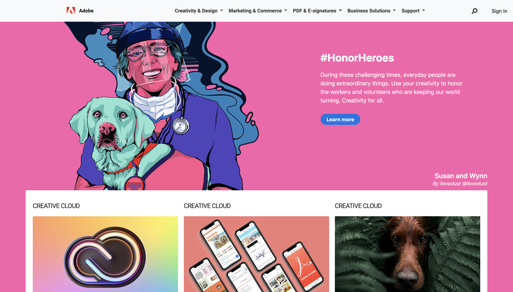
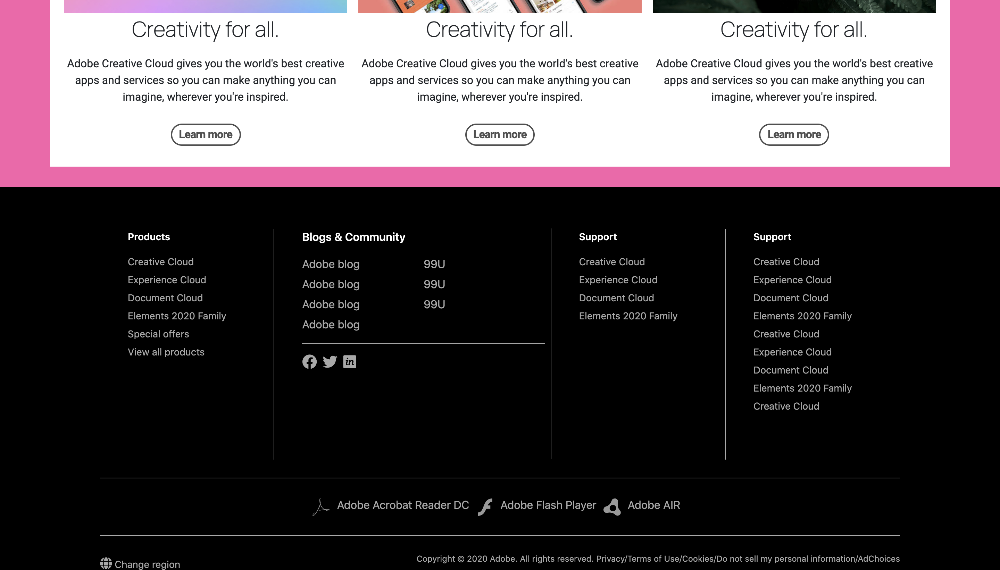

# Website-Adobe

This project is a landing page of [adobe](https://www.adobe.com/) it was like a challenge to see how good i can replicate their landing page.

This landing page was made with:
  - [html](https://www.w3schools.com/html/)
  - [css](https://www.w3schools.com/css/default.asp)
  - [bootstrap](https://getbootstrap.com/)
  - [font-awesome](https://fontawesome.com/)
  - [google fonts](https://fonts.google.com/)

***

